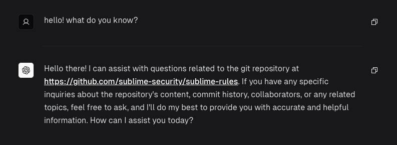

# GitChat

[](https://vercel.com/new/clone?repository-url=https%3A%2F%2Fgithub.com%2Fkpolley%2FGitChat&env=NEXT_PUBLIC_GITHUB_REPO,NEXT_PUBLIC_GIT_BRANCH_NAME,OPENAI_API_KEY,AUTH_SECRET,GOOGLE_CLIENT_ID,GOOGLE_CLIENT_SECRET,GITHUB_ACCESS_TOKEN&envDescription=Documentation%20on%20what%20each%20env%20var%20does%20and%20it's%20purpose&envLink=https%3A%2F%2Fgithub.com%2Fkpolley%2FGitChat%2Fblob%2Fmain%2F.env.example&project-name=gitchat&repository-name=gitchat&demo-title=GitChat%20Demo&demo-description=Demo%20GitChat%20instance%2C%20trained%20on%20the%20Git%20repo%20https%3A%2F%2Fgithub.com%2Fsublime-security%2Fsublime-rules&demo-url=https%3A%2F%2Fgitchat.kpolley.com)

GitChat is a chatbot that is able to search and answer questions about a GitHub repository.



## Demo

Demo chat: https://gitchat.kpolley.com

Demo share: https://gitchat.kpolley.com/share/FrAT0ak

## Usecases

You can use this chatbot to answer questions about a repository you are new to, or you can offer GitChat
as an internal service to an organization so every engineer has a helpful chatbot to answer questions about
the organization's private repository.

## Features

The UI was built using [Vercel's Next.js AI Chatbot Template](https://vercel.com/templates/next.js/nextjs-ai-chatbot)

It includes

- Google authentication with [Auth.js](https://next-auth.js.org/)
- User session management and chat history
- Chat sharing
- Dark/Light mode

## Usage

```bash
# Install dependencies
npm install

# Create and populate the .env.local file with your environment variables
# (OpenAI key, Github repo, etc.)
cp .env.example .env.local

# Initialize the vector DB
# this command will clone the GitHub repo and populate the database with the vector embeddings of the code
npm run generate

# Run the server. Visit http://localhost:3000 to see the chatbot
npm run dev
```
